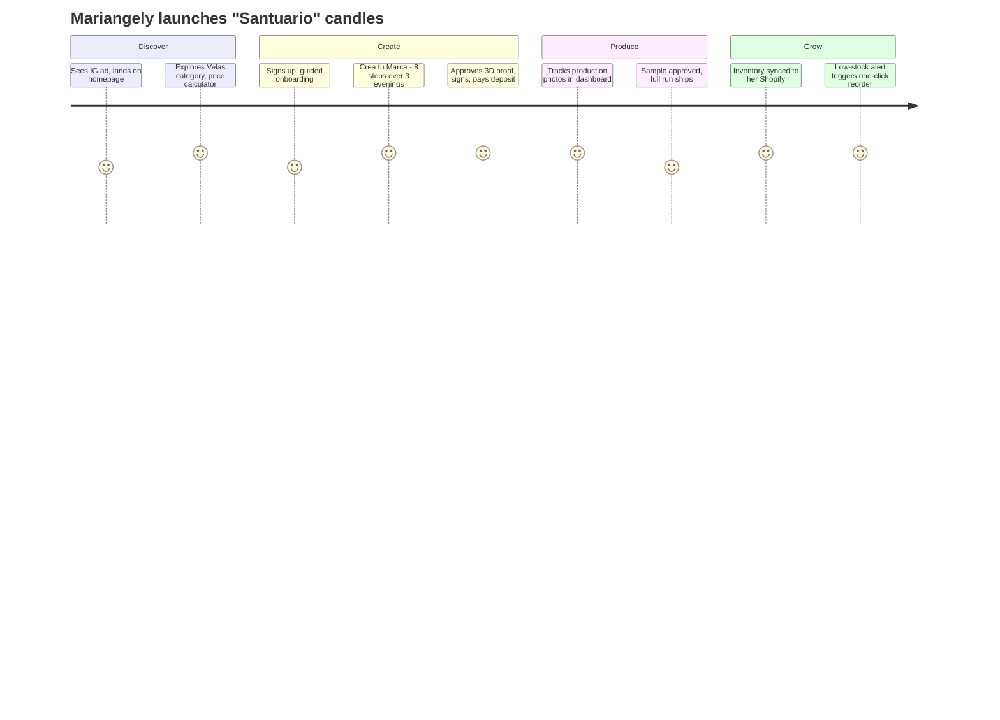
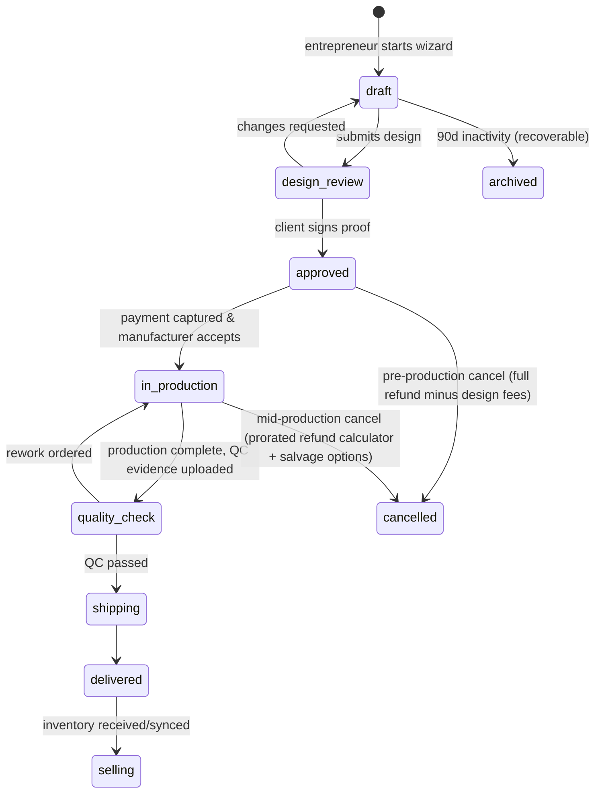
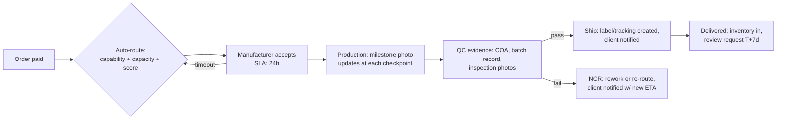

# Raíz Labs — Platform Specification
### "Crea tu marca. Representa tu cultura." — The operating system for Hispanic private-label entrepreneurs

Status: **Pre-implementation architecture — awaiting approval.** This document is the master specification derived from the Raíz Labs executive mandate. It is written so that engineering, design, and operations can begin implementation immediately, and it follows the mandated 16-section output format.

Reference visual: the approved homepage concept (warm cream/sand palette, matte-black product photography, serif display type, Spanish-first copy — "Crea tu marca. Representa tu cultura.", trust bar, category explorer, ¿Cómo funciona? timeline, productos destacados, "Tu cultura. Tu historia. Tu marca." CTA band).

---

## 1. Executive Summary

Raíz Labs is the **orchestration layer** for private-label and white-label brand creation, built first for Hispanic entrepreneurs in Puerto Rico, then the U.S. mainland, then Latin America. We are not a manufacturer: we connect entrepreneurs with verified manufacturers, packaging suppliers, designers, compliance specialists, and logistics partners — and we own the workflow, the trust layer, the payments, and the data in between.

**The product in one sentence:** an entrepreneur picks a product from a curated catalog, configures their brand and label in a guided studio, approves a proof, pays, and Raíz Labs orchestrates production, quality control, and delivery — with a dashboard that then helps them manage inventory, reorders, and growth.

**Core mechanics:**
- **Four-sided system:** Entrepreneur app, Manufacturer/Supplier portal, Designer portal, and Internal Ops/Admin console — one Next.js codebase, role-gated route groups.
- **The "Crea tu Marca" workflow** (8 steps: product → brand → design → formula → quantity → review → payment → confirmation) is the core product. Everything else exists to feed it or fulfill it.
- **Supabase** (Postgres + Auth + Realtime + Storage + RLS) as system of record; **Stripe** for payments, installments, and (later) Connect payouts to suppliers; **Resend** for transactional email.
- **Spanish-first, bilingual always.** Every string ships in ES and EN from day one; Spanish is the default locale in PR.
- Design proofs, versioning, and an approval workflow are first-class data — the design file *is* the contract artifact that goes to the manufacturer.

**Why we will win:** trust and cultural authenticity are the moat, not the catalog. Anyone can list white-label protein powder. Nobody else pairs a premium, Apple-grade bilingual experience with verified local/regional manufacturing, embedded compliance (FDA/FTC), embedded education, and an ops team that acts as the entrepreneur's back office. Every completed brand launch deepens our data advantage (what sells, at what MOQ, from which manufacturer, at what quality score) — which compounds into better recommendations, better pricing, and better supplier allocation than any competitor can bootstrap.

**Strategic decision flagged up front (per continuity rules — improving a prior decision, not restarting):** the original mandate's Section 6 proposes NestJS/FastAPI + GraphQL + Kubernetes + Elasticsearch + ClickHouse on day one. That stack is right for the company at scale and wrong for the company at month 3. This spec keeps the *architecture* (the data models, API contracts, and security model are designed exactly as mandated) but phases the *infrastructure*: Phase 1–2 ships on Next.js + Supabase + Vercel — the stack this team already operates in production — with clean seams (repository pattern, queue-backed jobs, versioned REST API) so each component can be promoted to the heavier option when volume demands it. Nothing in the product surface changes; time-to-first-customer drops by months.

---

## 2. Customer Experience

### 2.1 Personas

**1. Mariangely — The First-Time Founder (primary).** 29, San Juan. Sells candles at ferias artesanales, wants a real brand. Budget $1.5–4k. Speaks Spanish first. Fears: getting scammed, minimum orders she can't afford, regulatory trouble. Needs: hand-holding, transparent total cost ("¿cuánto me cuesta TODO?"), small MOQs, and proof other people like her succeeded.

**2. Carlos — The Scaling Operator.** 41, Orlando. Runs a supplement brand doing $30k/mo on Shopify, currently sourcing via Alibaba with pain. Needs: reliability, COAs and FDA compliance artifacts, inventory forecasting, Shopify sync, faster reorders, and someone accountable when a batch is late.

**3. Yaritza — The Side-Hustle Professional.** 35, nurse in Bayamón. Wants a hair-care line, has evenings only. Needs: mobile-first everything, async approvals, save-and-resume flows, financing/installments.

**4. Don Rafael — The Manufacturer.** Runs a 40-person contract manufacturer in Caguas. Wants steady order flow without doing his own sales, clear specs (no WhatsApp back-and-forth), and predictable payment. Tolerance for clunky software: low. The portal must be simpler than email or he won't use it.

**5. Sofía — Raíz Labs Ops.** Order fulfillment coordinator. Lives in the admin console. Needs SLA timers, exception queues, and one-click actions — her throughput *is* our unit economics.

### 2.2 The end-to-end entrepreneur journey



**Critical experience principles:**
1. **Total cost is always visible.** "Desde $7.50" on cards; a live per-unit + total-investment calculator on every configurator screen. No surprise fees at checkout, ever — this is the #1 trust-killer in this market.
2. **Save-and-resume everywhere.** Every step of Crea tu Marca autosaves as a draft `project`. Abandonment recovery email ("Tu marca te espera — retoma donde quedaste") at 24h and 72h.
3. **Skippable but never blocking.** Onboarding steps all have "Saltar por ahora"; KYC verification is only enforced at the payment step, not at signup.
4. **The proof is sacred.** Before money moves, the entrepreneur sees exactly what will be manufactured: 3D mockup, print-ready flat, spec sheet, quantity, unit cost, landed cost, timeline — and signs it. Digital signature + immutable snapshot = fewer disputes, cleaner ops.

### 2.3 The "Crea tu Marca" workflow (core product, 8 steps)

| Step | Screen | Key interactions | Exit state |
|---|---|---|---|
| 1. Producto | Catalog picker in-flow | Filter, compare (≤3), MOQ + price-break table | `project.product_id` set |
| 2. Marca | Brand configuration | Logo upload (SVG/PNG), color extraction + hex picker, packaging tier (Standard/Premium/Luxury) | `brand_profile` attached |
| 3. Diseño | Design Studio | Template or blank canvas, layers, fonts, AI suggestions, live 3D mockup | `design` v1+ saved |
| 4. Fórmula | Formula/spec builder (supplements, skincare, coffee roast profile, scent for candles) | Base + actives with dosage guidance, allergen warnings, cert filters; compliance checker runs live | `formulation` locked |
| 5. Cantidad | Quantity & pricing | MOQ slider with price breaks (100/500/1k/5k/10k), total investment breakdown, installment offer | `quote` generated |
| 6. Revisión | Review & approve | Full summary, design proof, terms, digital signature | `project.status = approved` |
| 7. Pago | Checkout | Stripe: card/ACH/Apple Pay/Google Pay; deposit vs full; installments | `order` created, payment authorized |
| 8. Confirmación | Confirmation | Timeline estimate, next steps, dashboard walkthrough CTA | Handoff to production pipeline |

Steps are a wizard but not a prison: a progress rail allows returning to any completed step (invalidating downstream steps with a clear warning: "Cambiar el producto reiniciará tu diseño").

---

## 3. UX/UI Recommendations

### 3.1 Design language

The approved homepage concept is the canon. Codify it exactly:

**Design tokens (Tailwind v4 `@theme`):**

```css
@theme {
  /* Color */
  --color-ink: #1A1A1A;          /* matte black — primary text, footer bg */
  --color-bronze: #C4A77D;       /* accent — CTAs, links, serif highlights */
  --color-copper: #A9825A;       /* gradient partner for bronze */
  --color-cream: #F5F0EB;        /* elevated surfaces, section bands */
  --color-sand: #E8E0D5;         /* borders, subtle fills */
  --color-success: #2D6A4F;  --color-warning: #D4A373;
  --color-error: #9B2335;    --color-info: #4A6FA5;
  --color-text-secondary: #5C5C5C; --color-text-tertiary: #8A8A8A;
  /* Type */
  --font-display: "Fraunces", ui-serif, serif;      /* headlines — matches concept's warm serif */
  --font-sans: "Inter", ui-sans-serif, system-ui;   /* UI, body */
  /* Shape & depth */
  --radius-card: 12px; --radius-button: 8px; --radius-modal: 16px;
  --shadow-card: 0 4px 24px rgb(0 0 0 / 0.06);
}
```

Typography scale, spacing scale (8px base grid: 4→128), container (max-w 1280px, 24px mobile / 48px desktop padding, 80px section breaks) exactly per the design DNA. Icons: Lucide as base (1.5px stroke, rounded caps — matches the concept's line icons) plus a custom set for categories.

### 3.2 Key screens (beyond the approved homepage)

- **Product Detail Page:** gallery left (zoom, 360° where available), sticky right rail with "Desde $X.XX" + MOQ note, live quantity→unit-price calculator, production timeline estimator, and the single dominant CTA **"Comenzar marca con este producto."** Tabs: Descripción · Especificaciones · Personalización · Opiniones · Preguntas frecuentes. Compliance badges (GMP, FDA-registered facility) rendered as verified chips linking to the certificate record.
- **Design Studio:** three-pane layout — layers left, canvas center (with bleed/safe/trim guides), properties + 3D preview right. On mobile: canvas full-screen, panels as bottom sheets. Skeleton screens, never spinners; 60fps canvas via `<canvas>` + OffscreenWorker rendering, 3D mockup via `<model-viewer>`/Three.js with a low-poly fallback for mid-tier devices.
- **Dashboard (El Centro de Control):** stats cards row → Kanban pipeline (Idea → Diseño → Producción → Envío → Venta) → activity feed + calendar rail. FAB "Nuevo proyecto."
- **Manufacturer portal:** deliberately austere — an order queue that reads like email: Accept / Decline / Ask a question. Every extra field costs adoption.

### 3.3 Interaction standards

- Page transitions: fade + 8px upward translate, 0.3s ease-out-cubic. Card hover: translateY(-4px) + shadow expand. Buttons: scale 1.02 on hover.
- Loading: skeletons with shimmer; progressive images (blur-up).
- Success: checkmark draw animation; confetti reserved for true milestones (first order placed, first delivery).
- All motion behind `prefers-reduced-motion` guards.
- **Bilingual toggle in the header** (ES ↔ EN) persists per account; all routes are locale-neutral with `next-intl` message catalogs — no `/en/` URL fork in Phase 1 (SEO hreflang added when EN marketing content ships).
- WCAG 2.1 AA: 4.5:1 contrast (bronze-on-cream fails for body text — bronze is accent/large-type only, ink for body), full keyboard nav, focus rings, ARIA live regions for calculator updates, axe checks in CI.

### 3.4 Design validation checklist (gate for every screen)

The 11-point checklist from the mandate (5-second comprehension, fewer steps, premium feel, trust, 5-year modernity, screen-reader + keyboard access, 60fps mid-tier mobile, ES/EN parity) is enforced as a PR template section for any UI change. A "No" blocks merge.

---

## 4. Business Logic

### 4.1 Pricing engine

Every catalog product carries **price-break tiers** and **modifiers**:

```
unit_price(qty, config) =
    base_tier_price(qty)                       -- from product_price_tiers (100/500/1k/5k/10k)
  + Σ variant_modifiers(config)                -- size, scent, formula actives
  + packaging_modifier(tier)                   -- Standard +0 / Premium +Δ / Luxury +Δ
total_investment = unit_price × qty
                 + setup_fees (plates, dies — shown as separate line, amortization note)
                 + design_services (if commissioned)
landed_cost/unit = (total_investment + est_shipping + est_duties) / qty   -- always shown
```

Rules: prices are **snapshotted onto the quote** at generation; a quote is valid 14 days; manufacturer cost changes never retro-apply to signed quotes. Margin is `quote_price − supplier_cost` per line, tracked for take-rate analytics.

### 4.2 Project lifecycle (state machine)



### 4.3 Order & payment rules

- **Deposit model:** orders ≥ $2,000 may split 50% deposit / 50% before ship; below that, full payment at checkout. Stripe PaymentIntent with manual capture for the deposit → capture on manufacturer acceptance (cancel/refund automatically if no acceptance within SLA).
- **Installments:** Stripe-native (Affirm/Klarna via Stripe) surfaced at Step 5 when eligible.
- **Refund matrix:** pre-production = 100% minus consumed design services; in-production = prorated by completed milestones; post-QC = replacement or credit only for verified defects (photo-evidence workflow).
- **Manufacturer payment:** net-15 after QC pass, via Stripe (Connect in Phase 3; manual ACH + invoice records in Phase 1–2).

### 4.4 Compliance logic

- Category-level rulepacks (supplements, skincare, food/coffee, candles) drive the **live compliance checker**: prohibited-ingredient list, claim scanning ("cures", "treats" → hard block; "supports" → disclaimer injection), required label elements (Supplement Facts, net weight ES/EN, PR-specific requirements).
- A project in a regulated category cannot reach `approved` without `compliance_status = passed` or a documented officer override (audit-logged).

---

## 5. Operational Workflow

### 5.1 Order orchestration (the ops backbone)



- **SLA timers on every arrow.** Manufacturer acceptance 24h; first production update 72h; QC review by ops 24h; every breach lands in the exception queue with an escalation ladder (coordinator → ops lead → account CSM).
- **Milestone photo updates** are contractual for manufacturers — they feed the entrepreneur's timeline view and are the single biggest trust lever ("mira, tu producto se está haciendo").

### 5.2 Supplier lifecycle

Recruit → verify (certifications, facility audit, sample run) → onboard to portal → probation (first 5 orders hand-monitored) → scored continuously (on-time %, QC pass %, response time) → tier (Preferred / Standard / Probation) → offboard. Certification expiry drives automatic alerts 60/30/7 days out; expired cert = auto-removal from routing until renewed.

### 5.3 Internal roles

| Role | Queue | Core actions |
|---|---|---|
| Fulfillment Coordinator | Orders needing attention (SLA-sorted) | Nudge manufacturer, update client, reroute, adjust ETA |
| QA Specialist | QC uploads pending review | Approve / reject with notes, trigger rework, release to ship |
| Compliance Officer | Flagged formulas/claims/labels | Approve, require changes, document override |
| Customer Success | Portfolio health dashboard | Proactive outreach on churn-risk & stalled projects |
| Staff Designer | Design review queue | Annotate proofs, prep print files, manufacturing handoff |

---

## 6. Backend Requirements

### 6.1 Stack (phased — see Executive Summary rationale)

**Phase 1–2 (ship it):**
- **Next.js (App Router) + TypeScript + Tailwind v4 + Framer Motion** on Vercel — marketing, app, portals, admin in one codebase with route groups: `(marketing)`, `(auth)`, `(crear)`, `dashboard/`, `portal/` (manufacturer/designer), `admin/`.
- **Supabase**: Postgres (system of record) + Auth (email/password, Google, Apple; MFA TOTP) + Storage (design files, certs, QC photos — private buckets, signed URLs) + Realtime (notifications, order status, messaging) + RLS as the authorization backbone.
- **Stripe** payments; **Resend** email (React Email templates, ES/EN); **Twilio** SMS (critical alerts only); **pg_cron + Supabase Edge Functions** for scheduled jobs; **Postgres-backed job queue** (`jobs` table with `FOR UPDATE SKIP LOCKED`) for webhooks/emails/renders.
- Search: **Postgres full-text + pg_trgm** (catalog is hundreds of SKUs, not millions — Algolia is Phase 3 if warranted).
- Analytics events: Postgres `analytics_events` table + GA4/Meta Pixel client-side; promote to a dedicated pipeline (PostHog or ClickHouse) in Phase 3.

**Phase 3+ promotion path (pre-designed seams):** API layer already versioned (`/api/v1`) and repository-patterned → can extract to NestJS services; queue table → BullMQ/Redis; FTS → Algolia; analytics table → ClickHouse; Vercel → containers/K8s only if compute shape demands it. **No rewrite, only relocation.**

### 6.2 Core services (modules within the codebase)

`catalog` · `projects` (wizard state) · `designs` (versioning, rendering, approval) · `pricing` (quote engine) · `orders` (state machine + payments) · `production` (manufacturer routing, milestones, QC) · `inventory` (levels, movements, forecasts, Shopify sync) · `assets` (brand library, versioned) · `messaging` (threads per project/order) · `notifications` (fan-out: in-app/email/SMS/push with per-user prefs) · `compliance` (rulepacks, scans, overrides) · `identity` (KYC, businesses, teams, roles) · `billing` (invoices, credits, subscriptions) · `admin` (impersonation w/ audit, CMS, support).

### 6.3 File & render pipeline

Design Studio saves JSON documents (block/layer model) → server render to PDF (print, CMYK, 300dpi, bleed) via a headless renderer job → outputs stored as immutable `design_versions` artifacts (JSON + PDF + PNG preview + spec sheet). The signed proof references an artifact hash — what was approved is provably what ships to the manufacturer.

---

## 7. API Requirements

### 7.1 Internal API

Server Actions for first-party mutations; REST under `/api/v1/*` for anything a portal, webhook, or future SDK needs. All REST: JSON, standard HTTP codes, cursor pagination (`?cursor=&limit=`), `Idempotency-Key` honored on POSTs that create money-adjacent resources.

**Surface (v1):**

```
Auth        POST /auth/*  (Supabase-managed)
Catalog     GET  /products, /products/:id, /categories
Pricing     POST /quotes  (config → priced quote, snapshot)
Projects    CRUD /projects, POST /projects/:id/submit-design, /approve, /sign
Designs     CRUD /projects/:id/designs, POST /designs/:id/versions, /comments, /render
Orders      GET/POST /orders, POST /orders/:id/cancel, /reorder ; GET /orders/:id/timeline
Production  POST /production/:id/accept|decline|milestone|qc  (portal-scoped)
Inventory   GET /inventory, POST /inventory/adjustments, GET /inventory/forecast
Assets      CRUD /brand-assets (+ versions, share links)
Messaging   GET/POST /threads/:id/messages
Webhooks in POST /api/webhooks/stripe, /shopify, /carriers
```

### 7.2 Outbound webhooks & integrations

- **Event bus pattern:** every domain event (order.status_changed, design.approved, inventory.low, qc.failed…) is written to `events`, fanned out by the queue to: in-app notifications, email/SMS, and (Phase 3) customer-registered webhooks with HMAC signatures + retries with backoff.
- **Shopify (Phase 3):** OAuth app; product publish, inventory level sync (two-way), order ingestion for fulfillment-by-Raíz. WooCommerce plugin next; Amazon/Etsy Phase 4.
- **Developer platform (Phase 4):** the same `/api/v1` surface, OAuth 2.0 client credentials + scoped API keys, tiered rate limits, OpenAPI 3.0 doc, sandbox tenant.

---

## 8. Database Design

Postgres, all tables `id uuid pk default gen_random_uuid()`, `created_at/updated_at timestamptz`, soft-delete via `deleted_at` where user-facing. Enums as Postgres enums. RLS on every table.

### 8.1 Identity & tenancy

```sql
profiles            (id fk auth.users, full_name, phone, locale enum('es','en') default 'es',
                     avatar_url, role enum('entrepreneur','staff','manufacturer','designer','admin'))
businesses          (id, owner_id, legal_name, dba, entity_type, tax_id_enc, kyc_status
                     enum('none','pending','verified','rejected'), address jsonb, verified_at)
business_members    (business_id, user_id, role enum('owner','admin','manager','viewer'), invited_by)
```

### 8.2 Catalog & pricing

```sql
categories          (id, slug, name_es, name_en, hero_image, position, parent_id)
products            (id, category_id, slug, name_es, name_en, description_es/_en,
                     specs jsonb, moq int, lead_time_days int4range, images jsonb,
                     status enum('draft','active','archived'), search tsvector)
product_variants    (id, product_id, kind enum('size','color','scent','flavor','material'),
                     name_es/_en, price_modifier_cents, is_default)
product_price_tiers (id, product_id, min_qty, unit_price_cents)     -- 100/500/1k/5k/10k breaks
packaging_options   (id, product_id, tier enum('standard','premium','luxury'),
                     price_modifier_cents, description_es/_en, sustainability jsonb)
formula_components  (id, category_id, kind enum('base','active','scent'), name, dosage_guidance,
                     allergens text[], certifications text[], price_modifier_cents, compliance_flags jsonb)
```

### 8.3 Projects, designs, quotes

```sql
projects            (id, business_id, product_id, name, status project_status,  -- §4.2 enum
                     wizard_step int, config jsonb,     -- variant/formula/packaging selections
                     archived_at, created_by)
brand_profiles      (id, business_id, name, logo_asset_id, colors jsonb, fonts jsonb)
designs             (id, project_id, current_version_id)
design_versions     (id, design_id, version int, doc jsonb,          -- layer/block document
                     preview_url, print_pdf_url, spec_sheet_url, artifact_hash,
                     created_by, immutable after render)
design_comments     (id, design_version_id, author_id, body, anchor jsonb, resolved_at)
quotes              (id, project_id, snapshot jsonb,   -- full priced breakdown, frozen
                     unit_price_cents, qty, total_cents, setup_fees_cents,
                     valid_until, status enum('draft','issued','signed','expired'))
signatures          (id, quote_id, signer_id, signed_at, ip, artifact_hash, terms_version)
compliance_checks   (id, project_id, rulepack, result enum('passed','flagged','blocked'),
                     findings jsonb, overridden_by, override_reason)
```

### 8.4 Orders, production, logistics

```sql
orders              (id, project_id, business_id, quote_id, status order_status,
                     total_cents, deposit_cents, balance_due_at, stripe_payment_intent_id)
order_line_items    (id, order_id, description, qty, unit_price_cents, supplier_cost_cents)
manufacturers       (id, name, capabilities text[], capacity jsonb, score numeric,
                     tier enum('preferred','standard','probation'), status, contact jsonb)
manufacturer_certs  (id, manufacturer_id, kind, file_url, issued_at, expires_at, verified_by)
production_orders   (id, order_id, manufacturer_id, status enum('offered','accepted','declined',
                     'in_production','qc','done'), accepted_at, due_at, sla_breached_at)
production_updates  (id, production_order_id, milestone, note, photos jsonb, actor_id)
qc_records          (id, production_order_id, kind enum('coa','inspection','batch_record','ncr'),
                     result enum('pass','fail'), files jsonb, reviewed_by, notes)
shipments           (id, order_id, carrier, tracking_number, status, label_url,
                     shipped_at, delivered_at, proof_photo_url, events jsonb)
```

### 8.5 Inventory, assets, money, comms

```sql
inventory_items     (id, business_id, sku, product_id, on_hand, reserved, reorder_point,
                     expiry_tracked bool, location jsonb)
inventory_movements (id, item_id, delta, reason enum('received','sold','adjustment','return',
                     'expired'), reference jsonb, actor_id)         -- append-only audit trail
brand_assets        (id, business_id, kind enum('logo','color','font','photo','label','doc'),
                     file_url, meta jsonb, folder, tags text[], current_version int)
asset_versions      (id, asset_id, version, file_url, uploaded_by)
payments            (id, order_id, stripe_id, kind enum('deposit','balance','full','refund','credit'),
                     amount_cents, status, raw jsonb)
credits             (id, business_id, amount_cents, reason, expires_at, consumed_cents)
invoices            (id, business_id, order_id, number, pdf_url, due_at, paid_at)
threads             (id, scope enum('project','order','support'), scope_id, participants uuid[])
messages            (id, thread_id, author_id, body, attachments jsonb, read_by jsonb)
notifications       (id, user_id, kind, payload jsonb, read_at, channel_log jsonb)
notification_prefs  (user_id, kind, in_app bool, email bool, sms bool, push bool)
support_tickets     (id, business_id, category, priority, status, assignee_id, csat int)
events              (id, kind, aggregate, aggregate_id, payload jsonb, created_at)  -- outbox
jobs                (id, kind, payload jsonb, run_at, locked_at, attempts, last_error)
audit_log           (id, actor_id, action, target, target_id, before jsonb, after jsonb,
                     ip, impersonator_id)              -- append-only, no UPDATE/DELETE grants
analytics_events    (id, anon_id, user_id, name, props jsonb, ts)   -- partitioned by month
```

**Indexing highlights:** `products.search` GIN; `projects (business_id, status)`; `production_orders (manufacturer_id, status)` for portal queues; `jobs (run_at) WHERE locked_at IS NULL`; `analytics_events` BRIN on `ts`.

---

## 9. Security Considerations

- **AuthZ = RLS first.** Every table policy derives from `business_members` (entrepreneur side), `manufacturer_users` (portal side), or `profiles.role='staff'/'admin'`. Cross-tenant reads are impossible at the database layer, not just the app layer. Money-moving and state-machine transitions go through `SECURITY DEFINER` RPCs (`sign_quote`, `accept_production_order`, `capture_order_payment`, `pass_qc`) that validate transitions atomically — same pattern proven in this team's prior build.
- **AuthN:** Supabase Auth; password policy 12+ chars with HaveIBeenPwned k-anonymity check at signup; TOTP MFA optional for entrepreneurs, **enforced** for staff/admin; session refresh-token rotation; device/session list with remote revoke.
- **KYC/PII:** tax IDs and ID documents encrypted at the field level (pgsodium) with keys outside the DB; ID uploads in a locked bucket readable only by the compliance role; retention policy (delete raw ID images after verification decision + statutory window).
- **Payments:** PCI scope stays inside Stripe Elements — card data never touches our servers. Stripe Radar for fraud; manual-review queue for first orders > $5k.
- **Admin impersonation** requires reason input, is time-boxed (30 min), banner-visible, and writes `audit_log.impersonator_id` on every row it touches.
- **Audit log** is append-only (revoked UPDATE/DELETE), exportable for regulators.
- **Platform hygiene:** TLS 1.3, HSTS, CSP with nonces, strict CORS on `/api/v1`, rate limiting (middleware + progressive delays + CAPTCHA after 3 failed logins), dependency scanning (Dependabot + `npm audit` in CI), secrets in Vercel/Supabase vaults, quarterly pen-test from Phase 3, SOC 2 Type II program starting Phase 4 (controls designed now: audit log, RBAC matrix, change management via PR review).
- **File uploads:** MIME + magic-byte validation, size caps, image re-encoding (strips payloads), AV scan job for docs, signed URLs with short TTL.

---

## 10. Admin Dashboard

Route group `admin/` (staff/admin only, MFA-enforced):

| Area | Contents |
|---|---|
| **Hoy (Ops home)** | Exception queue (SLA breaches, failed payments, blocked compliance), order volume today, at-risk orders map |
| **Pedidos** | All orders, timeline drill-in, manual state override (audit-logged + reason), refund console |
| **Fabricantes** | Onboarding pipeline, cert verification queue, scorecards (on-time %, QC pass %, response time), tiering, contract docs |
| **Usuarios** | Search, profile view, impersonate (guarded), suspend, KYC review queue, merge-duplicate workflow |
| **Finanzas** | Revenue, take rate, AOV, deposits outstanding, payment failures, supplier payables (net-15 queue), cohort LTV |
| **Contenido** | Homepage blocks, catalog copy ES/EN, blog, announcements, coupon codes — all editable without deploy (DB-driven blocks) |
| **Soporte** | Ticket queues, assignment, canned responses ES/EN, CSAT |
| **Cumplimiento** | Flag review queue, rulepack editor, override log, regulator export |
| **Sistema** | Job queue health, webhook delivery log, error rates (Sentry embed), feature flags |

---

## 11. Employee Workflow

Each internal role gets a **queue-first home screen** (never a blank dashboard): the queue is SLA-sorted, each item opens a focused work panel with one-click primary actions, and completing an item advances to the next automatically (Linear-style keyboard flow: `J/K` navigate, `E` complete, `A` assign).

Example — **QA Specialist daily loop:** open QC queue → item shows COA + inspection photos side-by-side with the signed spec sheet → Approve (releases to shipping, notifies client) or Reject (structured reason → NCR created → manufacturer notified → client ETA updated automatically). Target handle time < 6 min/item; the form design budget is derived from that number.

Escalation ladders are data (`escalation_rules`), not tribal knowledge: breach → notify role → 4h → notify lead → 12h → page ops manager + open incident thread.

---

## 12. Automation Opportunities

**Rule-based (Phase 1–2, queue-driven):**
- Inventory < reorder_point → draft reorder created + notification.
- Design unapproved 48h → CSM task; quote unsigned 7d → recovery email.
- Payment failed → smart retry (3x with backoff) → notify → offer alternate method → pause order.
- Delivered + 7d → review request; cert expiring 60/30/7d → supplier alerts; abandoned wizard 24/72h → recovery emails.

**AI-powered (Phase 3, all human-in-the-loop first):**
- **Design Assistant:** brand brief + assets → 3 label concepts into the Studio as editable documents (not flat images).
- **Compliance Checker v2:** LLM claim-scanning ES/EN against rulepacks, auto-drafted disclaimers, supplement-facts panel generation from the formulation record.
- **Recommendations:** "el 73% de emprendedores como tú también lanzaron pre-entreno" — co-launch patterns from `analytics_events` + order graph.
- **Forecasting:** stockout prediction 30/60/90d from sales velocity + lead times + seasonality; feeds reorder drafts.
- **Support chatbot:** bilingual first-line on help-center corpus with full-context human escalation into the ticket system.
- **Pricing optimizer (Phase 4):** retail price suggestions from category comps + margin targets.

**Guardrail:** no AI output moves money, approves a design, or contacts a customer without a human click until precision is proven per-feature (tracked as approval-rate metric).

---

## 13. Analytics & KPIs

**North-star metric: brands successfully launched per month** (first order delivered). Everything ladders to it.

| Layer | Metrics |
|---|---|
| Business | GMV, take rate, MRR (subscriptions Phase 3), AOV, LTV:CAC, payback, churn, NPS/CSAT |
| Funnel | Visit → signup → project started → design completed → quote signed → paid → delivered → **reorder** (the health metric that proves the flywheel) |
| Product | Activation (onboarding completion), time-to-first-order, wizard step drop-off, Studio session success rate, feature adoption |
| Ops | Manufacturer on-time %, QC pass %, end-to-end lead time, SLA breach count, exception queue age, support first-response/resolution |
| Performance | Core Web Vitals (LCP < 2.5s, INP < 200ms, CLS < 0.1), Lighthouse ≥ 95/100/100/100 budget in CI |

Instrumentation: typed event helper (`track('wizard_step_completed', {step, project_id})`) → `analytics_events` + GA4. Dashboards: weekly automated business review email (Resend, from a `pg_cron` rollup); executive dashboard in `admin/`; monthly board pack auto-generated (Phase 3).

---

## 14. Risks & Edge Cases

| Risk | Mitigation (designed-in) |
|---|---|
| Manufacturer fails / misses deadline | Routing engine has backup manufacturers per capability; SLA breach auto-escalates; client auto-notified with revised ETA + goodwill credit rule |
| Quality failure post-delivery | Photo-evidence claim flow → replacement/refund matrix; batch traceability via `qc_records` + lot numbers enables recall workflow |
| Supplier concentration | Routing caps any manufacturer at N% of category volume; scorecard tiers gate allocation |
| Payment fraud / chargebacks | Radar, manual review > $5k first orders, signed proof + audit trail as dispute evidence (win rate lever) |
| Regulatory change (FDA/FTC/PR) | Rulepacks are data — compliance officer updates rules, affected active projects auto-flagged for re-check |
| Corrupted design upload | Magic-byte validation + render-pipeline dry run at upload; helpful ES error + suggested fix |
| Cancel mid-production | Prorated refund calculator (milestones completed) + salvage options (unlabeled stock discount) |
| Duplicate accounts | Merge workflow in admin (assets, projects, orders re-parented; audit-logged) |
| Demand spikes (seasonal, viral) | Queue-based architecture absorbs bursts; capacity field on manufacturers throttles routing; expectation-managed ETAs |
| Team scale risk (small team, big surface) | Phased stack (§6.1); everything queue-first; ops tooling built *before* volume, not after |
| DB disaster | Supabase PITR + daily backups verified by restore drill quarterly |

---

## 15. Future Enhancements

- **Phase 3:** Shopify/WooCommerce two-way sync; subscriptions & plans; AI suite (§12); community forum; advanced forecasting; team seats & permission matrix; Algolia search if catalog warrants.
- **Phase 4:** Developer API platform (OAuth, sandbox, SDKs); Amazon/Etsy; international shipping + customs (multi-currency, DDP quoting via Freightos); LatAm expansion (MX/CO/AR — locale, tax, and compliance rulepacks per country); enterprise tier (dedicated CSM, custom contracts); native apps (React Native, reusing the API).
- **Beyond:** marketplace mode (entrepreneurs selling through Raíz Labs with payouts via Stripe Connect), financing products (production loans underwritten by our own order-history data — a moat only we can build), white-label the platform itself for regional partners.

---

## 16. Recommended Next Steps

1. **Approve this spec** (or annotate — Sections 4.3 refund matrix, 5.2 supplier tiers, and 6.1 phased-stack decision are the three business calls that gate everything else).
2. **Sprint 0 (week 1):** repo scaffold (route groups, design tokens from §3.1, CI with lint + axe + Lighthouse budgets), Supabase project + migrations for §8.1–8.3, Auth + onboarding skeleton.
3. **Sprint 1–3 (Phase 1 core):** marketing site to parity with the approved homepage concept; catalog + product detail with live price calculator; Crea tu Marca steps 1–2–5–6–7 (design studio stubbed with template-picker + logo placement only — full Studio is Phase 2); Stripe checkout; basic dashboard; admin order console; transactional email set.
4. **Content in parallel:** seed catalog (12 categories, ~40 SKUs with real price tiers from 2–3 committed manufacturers), ES/EN copy deck, legal pages (Términos, Privacidad, Acuerdo de Fabricación).
5. **Manufacturer pilot:** onboard 2 PR manufacturers manually against the §5.2 checklist before the portal exists — their friction becomes the portal's spec.
6. **Instrument from day one:** the §13 funnel events ship with the first deploy, not after.

**Definition of Phase 1 done:** a real entrepreneur completes Crea tu Marca, pays real money, and Raíz Labs ops runs the order to delivery through the admin console — with every state change visible to the customer in their dashboard.
